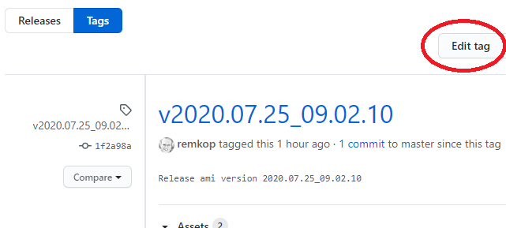
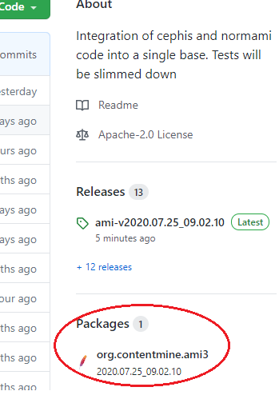

# Building 

`ami` requires Maven and Java 8 or greater to build.


## Get the latest source
You will need `git` installed. On Windows, [git for windows](https://gitforwindows.org/) is recommended.

At first, you need to download (check out) the project.
Open a terminal window, and execute the following command:

```bash
git clone https://github.com/petermr/ami3.git
```

This creates a directory `ami3` in your current directory.

The initial checkout may take a while, but you need to do this only once.
In future, you can update (pull only the latest changes from the server) by navigating to the `ami3` directory and running `git pull`:

```bash
cd ami3
git pull
```

## Building the binaries

The `ami` project requires Maven 3.1 or later (I use 3.6.2) to build (get it [here](https://maven.apache.org/download.cgi)).
You will also need a Java SE Development KIT 8 or later.
This can be obtained from multiple vendors: [OpenJDK](https://openjdk.java.net/install/index.html), [Oracle](https://www.oracle.com/java/technologies/javase-downloads.html), [Azul](https://www.azul.com/downloads/zulu-community), [Red Hat](https://developers.redhat.com/products/openjdk/download), etc.

Assuming you have both Maven and Java installed, run the following command to build the project:

> NOTE: Make sure `ami3` is sync'ed with the git repository first, using one of the commands in the previous section.

### Build without running the tests

This will take 3-10 minutes (the first time many dependencies need to be downloaded):
```bash
cd ami3
mvn clean install -DskipTests
```

The `clean` goal tells Maven to first delete the `./target/` directory. This is the place where Maven places the binaries resulting from the build process.

The `install` goal combines many steps: compiling sources, creating a `jar` file, creating a `./target/appassembler` directory with the distribution, creating archive files with this distribution, and finally installing the built ami jar under `org/contentmine/ami3` in your `$HOME/.m2/repository/` where Maven manages all library versions.

The `-DskipTests` option tell Maven to skip running the tests.

You can speed up this process even further by telling maven to skip compiling the tests (and not copying resource files used by the tests):

```bash
cd ami3
mvn clean install -Dmaven.test.skip=true
```

### Build and run all tests
Without the `-DskipTests` option, Maven will compile the sources and run all tests.
Running the tests is fairly slow, taking about 20 minutes on my machine.
As of this writing, many tests will fail, causing Maven to report that the build FAILED.

```bash
cd ami3
mvn clean install
```

### Build Results

The build generates a distribution image in the `./target/appassembler` directory.

The distribution has two directories:

 * `bin` which contains the launcher scripts for running `ami` commands.
 * `repo` which contains all the required jar library files. 

The build also creates compressed `.zip` and `.bz2` archives of the distribution.
(This is controlled by the [`src/assembly/distribution.xml`](src/assembly/distribution.xml) `maven-assembly-plugin` configuration.)

### For `ami` users
This is it, you are done!
You can now run all `ami` commands by executing the launcher scripts in the `./target/appassembler/bin` directory.
See [INSTALL.md](INSTALL.md) for more details.

### For `ami` developers
Read on to learn about versioning, creating a release and publishing distribution packages.

## (For Developers) Versioning

The `ami` project uses UTC timestamps for versioning.
* Release version strings: `yyyy.MM.dd_HH.mm.ss`
* Development version strings: `yyyy.MM.dd_HH.mm-NEXT-SNAPSHOT`

Timestamps must be in UTC to ensure monotonically increasing and unique timestamps when developers are in different time zones.

The version string is managed in a single place: the Maven `pom.xml`:

```xml
<project>
    <groupId>org.contentmine</groupId>
    <artifactId>ami3</artifactId>
    <version>2020.07.24_07.23-NEXT-SNAPSHOT</version>
...
</project>
```

This version string can be updated manually, or automatically with the `release.bash` script (details follow below).
Please follow the above timestamp format conventions if you update the version manually.


## (For Developers) Creating a Release in GitHub

The `ami` project uses GitHub's [concept of releases](https://docs.github.com/en/github/administering-a-repository/about-releases) to keep track of packages, along with release notes and links to binary files.

The release process starts by incrementing the version and creating a git tag.

Executing the `release.bash` script is the recommended way to increase the version and create a git tag.

### Run the `release.bash` script

The `release.bash` script updates the version string in the `pom.xml`, creates a git tag, and finally pushes the changes.

Alternatively, you can perform the same steps manually:

* update the version string in `pom.xml` to the current time in UTC using the `yyyy.MM.dd_HH.mm.ss` format
* commit the change to `pom.xml` (suggested commit message: `"Releasing ami yyyy.MM.dd_HH.mm.ss"`)
* run `git status` to ensure there are no uncommitted changes
* tag the last commit with `v + version`. For example: `v2020.07.24_07.23.42`.
* update the version string in `pom.xml` to the current time in UTC using the `yyyy.MM.dd_HH.mm-NEXT-SNAPSHOT` format
* commit the change to `pom.xml` (suggested commit message: `"Preparing for next release cycle"`)
* push the changes (including the tags)

### Convert the git tag to a GitHub Release

> NOTE: This is currently still a manual step.

Find the [Releases](https://github.com/petermr/ami3/releases) link on the project page right-hand side.


This opens the Releases page, showing the new git tag we just pushed.


Clicking this git tag opens a page where we can edit the tag to convert it into a GitHub Release.



Edit the release name and release notes.


Publish the release when we are done.


Our release now shows up as a GitHub Release instead of just a git tag.


See also the [GitHub documentation](https://docs.github.com/en/github/administering-a-repository/managing-releases-in-a-repository).


## (For Developers) Publishing to GitHub Packages
The act of creating a GitHub Release automatically results in the distribution archives being published to the GitHub Packages repository.

The binary release artifacts can be downloaded from https://github.com/petermr/ami3/packages

This is the [Packages](https://github.com/petermr/ami3/packages) link on the project page right-hand side.



We may want to also update the package description.


Copy the Release Notes into the package description.


### Under the hood

The `maven-deploy-plugin` plugin takes the distribution archives created by the `mvn package` phase and uploads them to the artifact repository configured in the `<distributionManagement>` section in the `pom.xml`.

In our `pom.xml` we have the following section to upload our archives to GitHub Packages:

```xml
<distributionManagement>
    <repository>
        <id>github</id>
        <name>GitHub petermr Apache Maven Packages</name>
        <url>https://maven.pkg.github.com/petermr/ami3</url>
    </repository>
</distributionManagement>
```

#### Automatic Publishing with GitHub Action

We have a GitHub Action workflow configured in [`.github/workflows/mavenpublish.yml`](.github/workflows/mavenpublish.yml).
This workflow is triggered by a GitHub Release, and will build the project and finally call the Maven `deploy` goal:

```bash
mvn -DskipTests -B deploy
```

> NOTE: This is the recommended way to publish to GitHub Packages, since it does a clean checkout and build from the release tag.
There is no chance that the published artifacts contain files that were not checked into git.

#### Manually publishing directly to GitHub Packages

We can also manually publish to GitHub Packages by running `mvn -B deploy -DskipTests` on our local machine.

To publish to GitHub Packages from our local machine, we need to:
* [Create a personal access token](https://docs.github.com/en/packages/publishing-and-managing-packages/about-github-packages#about-tokens) to authenticate to GitHub Packages with Apache Maven.
* Edit our `~/.m2/settings.xml` file to [include our personal access token](https://docs.github.com/en/packages/using-github-packages-with-your-projects-ecosystem/configuring-apache-maven-for-use-with-github-packages).

> NOTE: I have not tested this.

## Building Docker image

You can also build a Docker image based:

```bash
docker build --tag ami3 .
```

Then you can run the container and execute commands in the container:

```bash
$ docker run --rm -it ami3
root@aa87395224cc:/workspace# ami-pdf --help
Usage: ami-pdf [OPTIONS]
Description
===========
Convert PDFs to SVG-Text, SVG-graphics and Images. Does not process images,
[...]
```

You can also directly run commands and exit the container rightaway and mount directories with data:

```bash
$ docker run --rm -it -v $(pwd):/workspace ami3 ami-image example.jpg
Usage: ami-image [OPTIONS]
Description
===========
        transforms image contents but only provides basic filtering (see ami-filter).
Services include

 identification of d
 [...]
```

## Troubleshooting

### BUILD FAILED: Failed to clean project
On Windows, we occasionally see the build failing with this error:

```xml
[INFO] BUILD FAILURE
[INFO] ------------------------------------------------------------------------
[INFO] Total time: 0.471s
[INFO] Finished at: Mon Month DD HH:MM:SS YYYY
[INFO] ------------------------------------------------------------------------
[ERROR] Failed to execute goal org.apache.maven.plugins:maven-clean-plugin:2.4.1:clean (default-clean) on project ami3: Failed to clean project: Failed to delete C:\Users\remko\ami3\target\some\file -> [Help 1]
```

This happens when you have a file open in the `./target/` directory. For example:
* Did you open a `.zip` or `.jar` file in WinZip and is the WinZip process still running?
* Do you have a Command Prompt window open with the directory set to `./target/appassembler/bin`?

If so, close these windows and processes and try again.

### Error: remote end hung up unexpectedly

**For Windows:** If you get the following error when `git clone`-ing the project:
```
Cloning into ami3...
remote : Enumerate objects: 1936, done
remote : Counting objects: 100% (1936/1936), done.
remote : Compressing objects: 100% (1155/1155), done.
error: RPC failed; curl 18 transfer closed with outstanding read data
fatal: the remote end hung up unexpectedly
fatal: early EOF
fatal: index-pack failed
```

Use the following commands step-by-step:

```
git clone https://github.com/petermr/ami3 --depth 1
cd ami3
git fetch --unshallow
```


## Tests
NOTE: Tests are a work in progress. 

Tests are separated in unit tests and integration tests.
Integration tests have names that end in `IT` and are run during a different Maven build phase:

* Unit tests are run by the Maven Surefire plugin during the `test` phase (so included when you run `mvn package`) and failing unit tests fail the build.
* Integration tests are run by the Maven Failsafe plugin during the `integration-test` and `verify` phases of the build, so included when you run `mvn verify`, or `mvn install`. Failing integration tests will not fail the build.

There is a switch `skipITs` to disable the integration tests, but it is currently disabled:

```
# currently does not work
mvn clean install -DskipITs=false
```

As mentioned earlier, if you wish to skip compiling the tests, run:
```
mvn clean install -Dmaven.test.skip=true
```


## History

It used to be that the ami `pom.xml` file depended on a parent:
```
<parent>
    <groupId>org.contentmine</groupId>
    <artifactId>cm-parent</artifactId>
    <version>7.1.0</version>
</parent>
```

Since July 2020, this is no longer the case:

* the parent POM was causing issues with the `maven-release-plugin`: the parent POM has `hg` (mercurial) configured as SCM; this caused the `mvn-scm-plugin` to select the `hg` provider instead of `git`, making it impossible to execute `git commit` or `git tag` automatically during the release.
  We ended up not using the `maven-release-plugin`, so this may not be an issue.
* the parent POM was causing issues with the `maven-deploy-plugin`, preventing us to publish packages to GitHub Packages.
  We consistently got this error: "`Failed to execute goal com.github.github:site-maven-plugin:0.12:site (default) on project ami3: No authentication credentials configured`".
  This error disappeared and we successfully published to GitHub Packages after removing the parent POM and also removing this section from `pom.xml`:
```xml
    <repositories>
        <repository>
            <id>cm-pom</id>
            <url>https://raw.github.com/ContentMine/cm-pom/mvn-repo/</url>
            <snapshots>
                <enabled>true</enabled>
                <updatePolicy>always</updatePolicy>
            </snapshots>
        </repository>
    </repositories>
```

The authentication problem may have been caused by the `<repositories>` section, in which case the parent POM can be restored.


