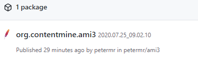
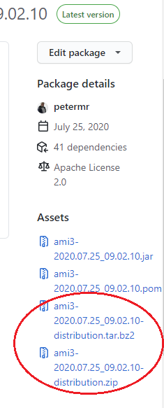

# Installing/running AMI

## Building from source
See [BUILDING.md](BUILDING.md).
The rest of this document relates to running the prebuilt package.

## Downloading
As of July 24, 2020, binary distributions of AMI are hosted on GitHub Packages.
Obtain the latest version here: https://github.com/petermr/ami3/packages/327360.
There is a [Packages](https://github.com/petermr/ami3/packages) link on the project page [right-hand side](doc/img/project-packages.png).


The `ami` project currently only publishes one package.




Click on the `org.contentmine.ami3` link to see the package details.
Find the `.bz2` or `.zip` distribution archive under the **Assets** heading on the right-hand side of the page. The link will look something like [`ami3-2020.07.25_09.02.10-distribution.zip`]().




Download the archive and unzip it somewhere. The result will look something like this:

```
.
└── ami3-2020.07.25_09.02.10
    ├── LICENSE
    ├── README.md
    ├── bin
    │   ├── ami
    │   ├── ami-all
    │   ├── ami-all.bat
    │   ├── ...
    │   ├── ami.bat
    │   ├── amidict
    │   ├── amidict.bat
    │   ├── pman
    │   └── pman.bat
    └── repo
        ├── ...
        ├── ami3-2020.07.25_09.02.10.jar
        ├── ...
```

## Java
To run `ami` you will need to have Java 8 or higher installed.
See [here](https://java.com/en/download/help/index_installing.xml) for instructions on how to install Java for your operating system.

## Running AMI

Ami is a set of command line applications.
It does not have a graphical user interface; to run `ami`, you need to type commands in a terminal (also called the shell, console, prompt or various other names).

After unzipping the distribution archive, you will find two directories:

 * `bin` which contains the launcher scripts for running `ami` commands.
 * `repo` which contains all the required jar library files. 

To use `ami`, execute the scripts in the `bin/` directory.
Good starting points are the `ami` and `amidict` commands.
Try the online help to get an overview of the available options and subcommands:

```bash
cd ami3-2020.07.25_09.02.10/bin/
ami --help
```

This will print the usage help to the console.

Another useful option is `--version` (or `-V`) to display version information:

```bash
cd ami3-2020.07.25_09.02.10/bin/
ami --version
```

### AMI Data
Many `ami` commands create files and directories in your current directory.
You probably want to keep your data separate from the `ami` software, so you can easily upgrade by unzipping another `ami3-yyyy.mm.dd_hh.mm.ss-distribution.zip` file.

Set up your `PATH` so you can run the `ami` commands from any directory.

## Path

### Setting your PATH on Windows

The instructions below assume that after unzipping the distribution archive, you have a directory named `ami3-2020.07.24_07.23.42` in your home directory.

You want to add the `ami3-2020.07.24_07.23.42\bin` directory to your path.

We recommend creating a `AMI_HOME` environment variable and setting this variable to the location where you unzipped the distribution archive.
On Windows, we can use the `setx` command for that.
For example:

```
setx AMI_HOME=%USERPROFILE%\ami3-2020.07.24_07.23.42
```

Then, use the [Edit Environment Variables](https://www.howtogeek.com/118594/how-to-edit-your-system-path-for-easy-command-line-access/) (User variables) dialog to add `%AMI_HOME%\bin` to your `PATH` environment variable.

When you install a new version of `ami`, all you need to do is point `AMI_HOME` to the location of the new unzipped distribution archive.

**Do not use `setx` to modify the `PATH` environment variable**; `setx` truncates paths longer than 1024 characters.
Use `setx` only for the `AMI_HOME` variable.

You may need to open a new Command Prompt window for the changes to take effect.
When you type `echo %PATH%` on the command line, you should see the `ami3-2020.07.24_07.23.42\bin` directory in the output.

### Setting your PATH on Unix

The instructions below assume that after unzipping the distribution archive, you have a directory named `ami3-2020.07.24_07.23.42` in your home directory.

You want to add the `ami3-2020.07.24_07.23.42/bin` directory to your path.

On unix, you can edit your `~/.bashrc` file to add this line:

```
export PATH=$PATH:~/ami3-2020.07.24_07.23.42/bin
```

You may need to start a new shell session for the chagnes to take effect.

When you type `echo $PATH` on the command line, you should see the `ami3-2020.07.24_07.23.42/bin` directory in the output.

See https://kb.iu.edu/d/acar for another tutorial.

## Learning More About AMI

See the [Running AMI](https://github.com/petermr/ami3/blob/master/README.md#running-ami) section in the README to learn more about the various `ami` commands.

## Dependencies
Some `ami` commands invoke external programs.
These must be installed separately (although they may be included if you are running `ami` in a Docker container).

* `tesseract` for character recognition in bitmaps ([tesseract-ocr GitHub project](https://github.com/tesseract-ocr/tesseract), expected to be installed in `/usr/local/bin/tesseract`). Used by `ami-image`, `ami ocr`, `ami forest`.
* `gocr` which is an alternative for character recognition ([GOCR sourceforge project](http://jocr.sourceforge.net/), expected to be installed in `/usr/local/bin/gocr`). Used by `ami ocr`.
* `grobid` to convert PDF streams to HTML ([GROBID docs](https://grobid.readthedocs.io/en/latest/)). Used by `ami grobid`.
* `latexml` and `latexmlpost` to converts TeX input to HTML 5 ([LaTeXML home](https://dlmf.nist.gov/LaTeXML/)). Used when some options are selected in `ami transform`.
* `curl` and other unix-like utilities. On Windows, [git for windows](https://gitforwindows.org/) includes `curl`. You may also be interested in Windows Subsystem for Linux. Used by `ami download`.

The `getpapers` program is often used together with `ami`: 
* `getpapers` gets metadata, fulltexts or fulltext URLs of papers matching a search query ([ContentMine getpapers GitHub project](https://github.com/ContentMine/getpapers))
